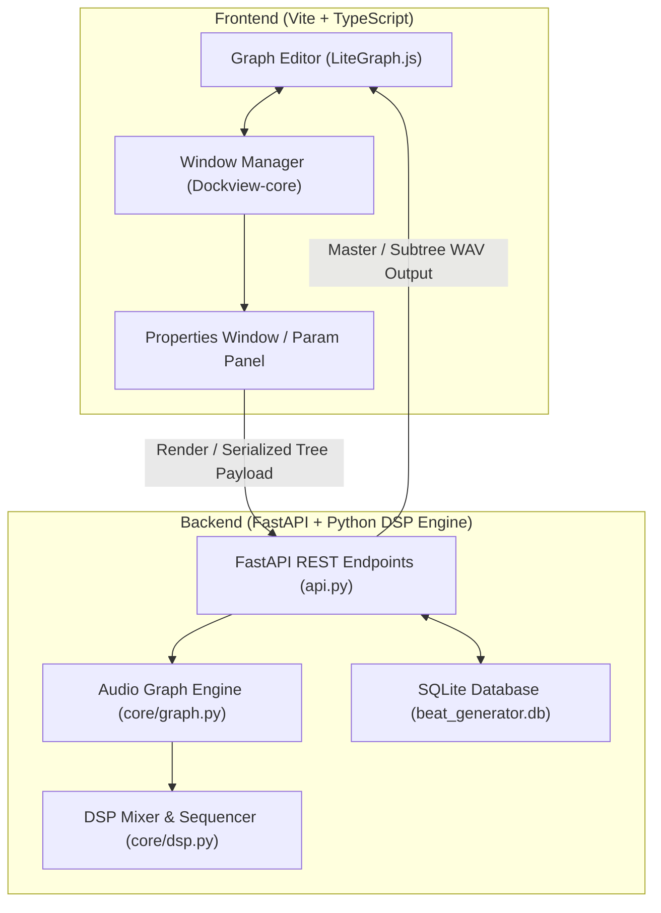

# Automated Beat Generator

An automated DSP-driven beat generator application featuring a graph-based audio object model, FastAPI backend, and interactive web interface.

---

## Application Architecture



### 1. Frontend Architecture

- **Graph Workspace (`LiteGraph.js`)**:
  - Direct straight-line connection model (`LiteGraph.LINEAR_LINK`).
  - Double-click canvas context menu (`NodePopupMenu`) for creating root or child nodes.
  - Interactive canvas buttons on each node for **Render Subtree (▶)**, **Add Child Node (+)**, and **Delete Node (✕)**.

- **Audio Node Hierarchy**:
  - `TrackNode` (`Audio/Track`): Container track supporting `sum` (layered) or `chained` (sequential) mix modes, custom titles, and engine BPM.
  - `SampleNode` (`Audio/Sample`): Audio asset reference node with start beat positioning, sample library asset picker, preview player, and original BPM settings.
  - `SequenceNode` (`Audio/Sequence`): 16-step interactive step sequencer generator supporting customizable step timing (`step_length`).

- **Window Management & Graph Collapsing**:
  - **Single Parameter Window Policy**: Guarantees that at most **one** parameter window (`PropertiesWindow` panel in Dockview) is open at any time. Selecting a new node automatically closes any previously open parameter window.
  - **Dynamic Node Collapsing**: When closing a parent node's parameter window—if no child node parameter window is currently open—the child graph nodes automatically collapse back (`flags.collapsed = true`) to keep the canvas clean and compact. Opening a parent or child parameter window uncollapses the relevant branch.

### 2. Backend DSP Engine Architecture

- **Subtree Serialization (`api.py` / `core/`)**:
  - Nodes in the visual graph are converted into a recursive JSON tree payload (`serializeNodeSubtree`) upon rendering.
- **Audio Processing Pipelines**:
  - **Sample Processing**: Automated time-stretching and pitch adjustment to align asset audio to the engine BPM.
  - **Sequence Engine**: Converts 16-step active bit patterns into precisely timed audio triggers over the track duration.
  - **Mixing Engines**: Supports parallel (`sum`) mixing for multi-sample layering and sequential (`chained`) concatenation for beat arrangements.

---

## Launching from Terminal (with Debug Messages)

You can launch the software directly from your terminal using any of the following convenient options. Debug logging is enabled by default so all request details, DSP render steps, and audio loading logs will be printed live to your terminal:

### Option 1: Using `run.py` (Recommended)
```bash
python run.py
```
*Optional Flags:*
- `python run.py --port 8080` (Change port)
- `python run.py --log-level info` (Change log level: `debug`, `info`, `warning`, `error`)
- `python run.py --no-reload` (Disable live reloading)

### Option 2: Using the CLI
```bash
python cli.py serve
```
*Optional Flags:*
- `python cli.py serve --port 8000 --debug`

### Option 3: Using npm
```bash
npm start
# or
npm run dev
```

### Option 4: Direct execution with Python or Uvicorn
```bash
python api.py
# or
uvicorn api:app --reload --log-level debug
```

---

## Project Structure

- `api.py` - FastAPI backend server serving REST endpoints and the static frontend UI.
- `run.py` - Easy terminal launcher script with debug logging.
- `cli.py` - Typer CLI tool for managing samples and starting the server.
- `core/` - Audio graph engine, DSP processing, sample loading, and BPM analyzer routines.
- `database/` - SQLite database helper and schema initialization (`beat_generator.db`).
- `frontend/` - Modern Vite TypeScript frontend source code.
  - `src/main.ts` - Application entry point, LiteGraph initialization, Dockview window management, and collapse logic.
  - `src/ui/PropertiesWindow.ts` - Node properties UI forms for Track, Sample, and Step Sequencer.
  - `src/ui/CanvasButton.ts` - Interactive node canvas button overlays.
  - `src/nodes/` - Custom LiteGraph node definitions (`BaseNode`, `TrackNode`, `SampleNode`, `SequenceNode`).
- `static/` - Built frontend web app bundle served by FastAPI.
- `.gitignore` - Ignore rule definitions for virtual environments, database files, compiled assets, and audio renders.
